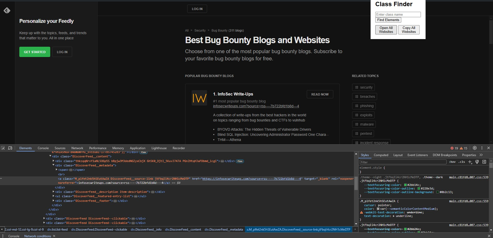
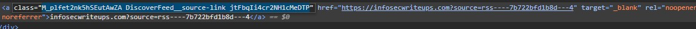
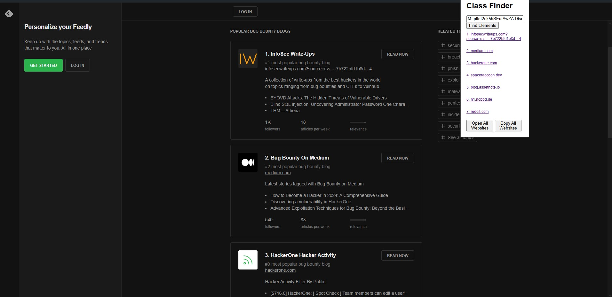

# Class Finder Chrome Extension

Class Finder is a Chrome extension that helps you find all elements on a webpage with a specific class attribute. It also allows you to open or copy the URLs found.

## Features
- Search for elements by class name on the current webpage.
- Display found elements as clickable links.
- Open all found URLs in new tabs.
- Copy all found URLs to the clipboard.

## Installation

1. **Clone or download this repository:**
    ```bash
    git clone https://github.com/your-username/class-finder.git
    ```
    Or download the ZIP file from GitHub and extract it.
   
3. **Open Chrome and go to the Extensions page:**
    ```chrome
    chrome://extensions/
    ```
    
4. **Enable Developer Mode:**
    - Toggle the "Developer mode" switch in the top right corner of the page.

5. **Load the extension:**
    - Click the "Load unpacked" button.
    - Select the directory where you cloned or extracted the extension files.

## Usage

1. **Open the extension:**
    - Click on the Class Finder icon in the Chrome toolbar.

2. **Enter the class name:**
    - Type the class name you want to search for in the input field.

3. **Click the "Find Elements" button:**
    - The extension will display a list of elements with the specified class name.

4. **Interact with the found elements:**
    - Click on any element link to open it in a new tab (without redirecting the current tab).
    - Use the "Open All Websites" button to open all found URLs in new tabs.
    - Use the "Copy All Websites" button to copy all found URLs to the clipboard.

## Screenshots




### I would like to upload it to google extension, but I will wait for now because it wants 5 dollars :)
